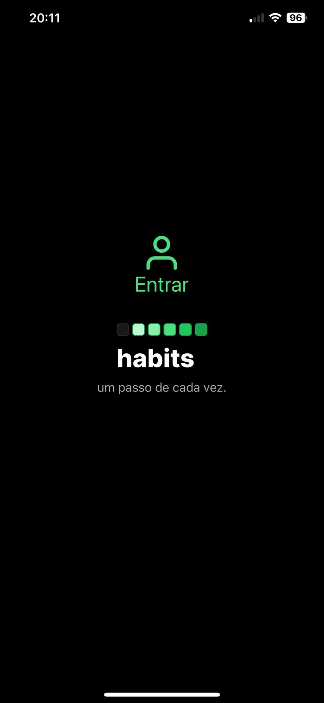
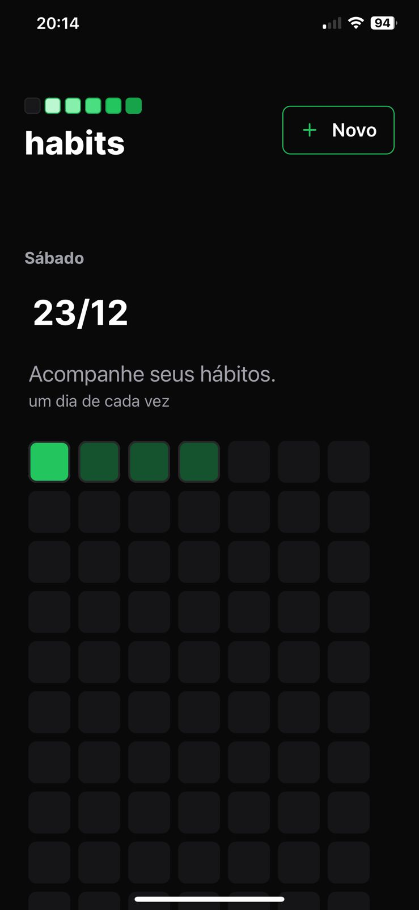
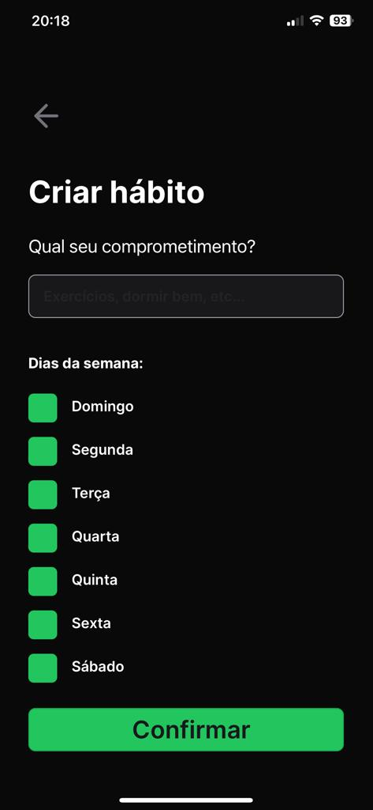
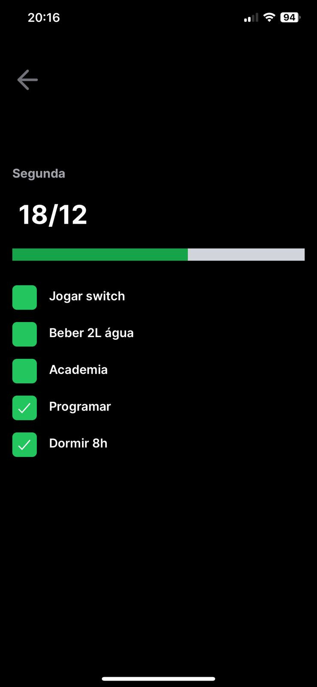

<h1 align="center">Bem-vindo ao lemon-track-habits, API 🍋</h1>

  

  

    
   
 
 
 
  
 
 

## ✨ Features ✨

Aplicativo desenvolvido com react native e expo para acompanhamento de hábitos diários.

* Login : fake login screeen
  
* Home : Lista dos seus hábitos

* Novo hábitos : criei um novo hábito

* Hábito: lista dos hábitos por dia

## Mobile

[📃 saiba mais aqui](./mobile-hack-habits/README.MD)

## Api

[📃 saiba mais aqui](./api/README.MD)

## Tecnologias

### Mobile

[expo](https://expo.dev/)
[react native](https://reactnative.dev/docs/getting-started)
[react](https://react.dev/learn)
[context api](https://react.dev/reference/react/useContext)
[typescript](https://www.typescriptlang.org/docs/)
[tailwindcss](https://tailwindcss.com/)

### Api

[nodejs](https://nodejs.org/en)
[fastify](https://fastify.dev/)
[prisma](https://www.prisma.io/)
[sqlite](https://www.sqlite.org/index.html)

### ✨ [Demo]

Login:

Home:

Novo Habito:

Habitos:

## Author

👤 **Anderson Lima**

* Website: [lemon.dev.br](https://lemon.dev.br)
* Twitter: [@andersonlimahw](https://twitter.com/andersonlimahw)
* Github: [@andersonlimahw](https://github.com/andersonlimahw)
* LinkedIn: [@andersonlimahw](https://linkedin.com/in/andersonlimahw)

Agradecimentos:
[@rocketseat](https://www.rocketseat.com.br/) pelo projeto desenvolvido na nlw.
