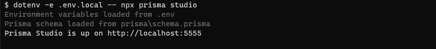
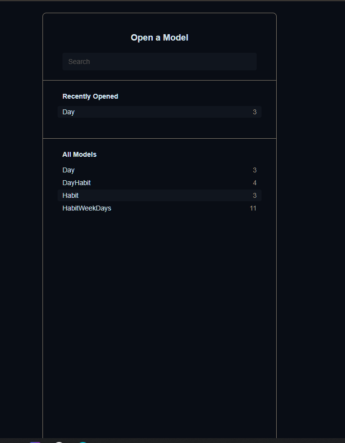
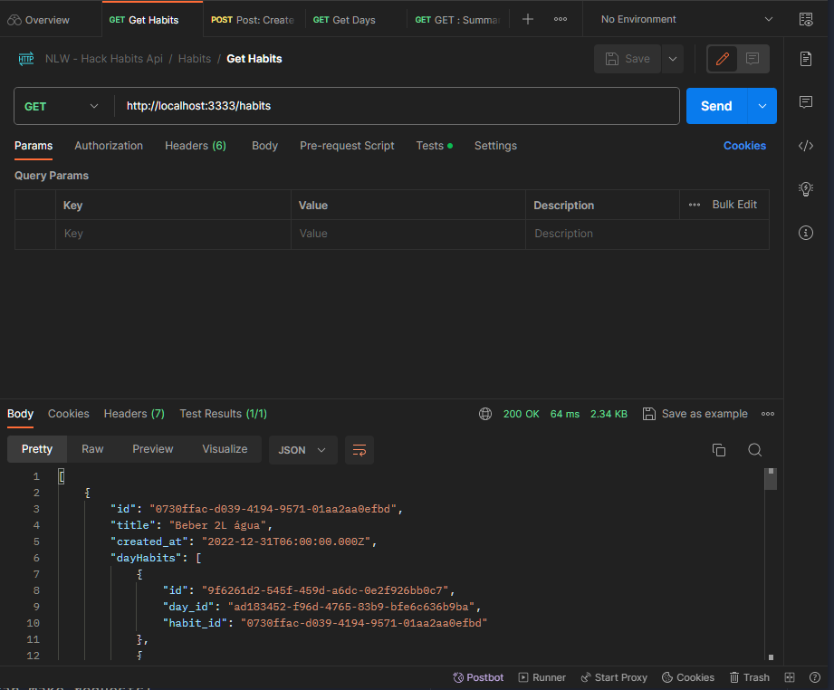

## Prisma

Install prisma globally:

```shell
  npm i -g prisma

```

Run migrations:

```shell  
  prisma migrate dev --name 20230201230453_creating_database

```

Run seed to populate dabase with data

```shell  
  npm run seed

```

Running prisma studio

```shell
  dotenv -e .env.local -- npx prisma studio

```

Expected:

Prisma Studio is up on <http://localhost:5555>

Terminal:



Browser:


In another terminal, run api

Start server:

```shell  
  npm run dev

```

Now you api is running and you can make requests!

